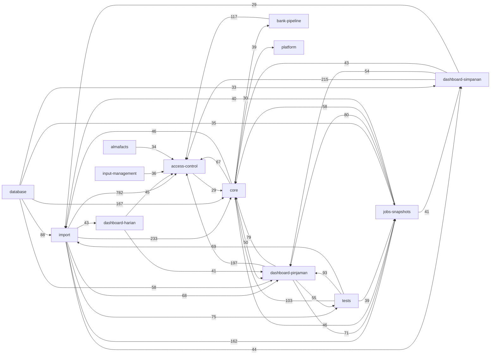

# Architecture Map

This is a compact cross-domain view. Edge labels are static relation counts, not runtime traffic.

## Domain Index

| Domain | Nodes | Detail |
| --- | ---: | --- |
| import | 2725 | [open](domains/import.md) |
| core | 1324 | [open](domains/core.md) |
| dashboard-pinjaman | 1203 | [open](domains/dashboard-pinjaman.md) |
| jobs-snapshots | 769 | [open](domains/jobs-snapshots.md) |
| dashboard-simpanan | 759 | [open](domains/dashboard-simpanan.md) |
| database | 736 | [open](domains/database.md) |
| dashboard-harian | 440 | [open](domains/dashboard-harian.md) |
| bank-pipeline | 399 | [open](domains/bank-pipeline.md) |
| tests | 384 | [open](domains/tests.md) |
| presentation | 278 | [open](domains/presentation.md) |
| access-control | 210 | [open](domains/access-control.md) |
| prognosa | 184 | [open](domains/prognosa.md) |
| almafacts | 139 | [open](domains/almafacts.md) |
| marketshare | 130 | [open](domains/marketshare.md) |
| knowledge-graph | 117 | [open](domains/knowledge-graph.md) |
| platform | 98 | [open](domains/platform.md) |
| kpi | 60 | [open](domains/kpi.md) |
| input-management | 58 | [open](domains/input-management.md) |
| routing | 3 | [open](domains/routing.md) |
