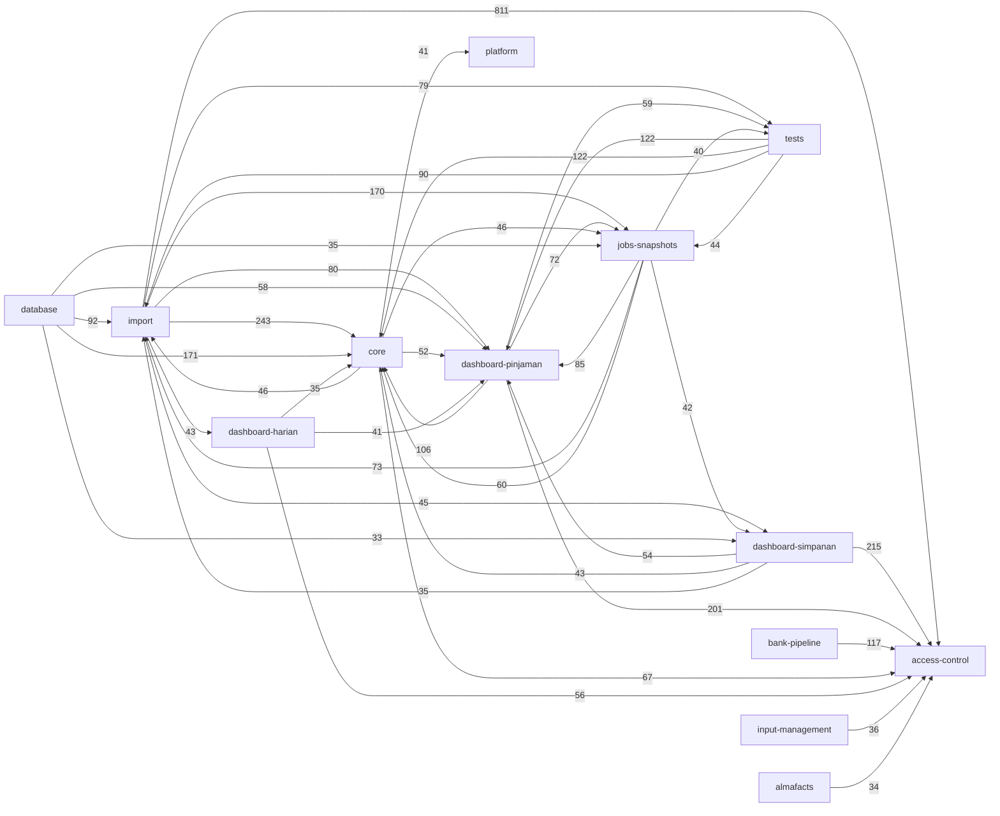

# Architecture Map

This is a compact cross-domain view. Edge labels are static relation counts, not runtime traffic.

```mermaid
flowchart LR
    d_d942f64886["import"] -->|811| d_c393a69167["access-control"]
    d_d942f64886["import"] -->|243| d_0d45f5fd46["core"]
    d_90026ec21f["dashboard-simpanan"] -->|215| d_c393a69167["access-control"]
    d_c1933689a3["dashboard-pinjaman"] -->|201| d_c393a69167["access-control"]
    d_3549b0028b["database"] -->|171| d_0d45f5fd46["core"]
    d_d942f64886["import"] -->|170| d_7c16aa6a77["jobs-snapshots"]
    d_59830ebc3a["tests"] -->|122| d_c1933689a3["dashboard-pinjaman"]
    d_59830ebc3a["tests"] -->|122| d_0d45f5fd46["core"]
    d_39bcb775e4["bank-pipeline"] -->|117| d_c393a69167["access-control"]
    d_c1933689a3["dashboard-pinjaman"] -->|106| d_0d45f5fd46["core"]
    d_3549b0028b["database"] -->|92| d_d942f64886["import"]
    d_59830ebc3a["tests"] -->|90| d_d942f64886["import"]
    d_7c16aa6a77["jobs-snapshots"] -->|85| d_c1933689a3["dashboard-pinjaman"]
    d_d942f64886["import"] -->|80| d_c1933689a3["dashboard-pinjaman"]
    d_d942f64886["import"] -->|79| d_59830ebc3a["tests"]
    d_7c16aa6a77["jobs-snapshots"] -->|73| d_d942f64886["import"]
    d_c1933689a3["dashboard-pinjaman"] -->|72| d_7c16aa6a77["jobs-snapshots"]
    d_0d45f5fd46["core"] -->|67| d_c393a69167["access-control"]
    d_7c16aa6a77["jobs-snapshots"] -->|60| d_0d45f5fd46["core"]
    d_c1933689a3["dashboard-pinjaman"] -->|59| d_59830ebc3a["tests"]
    d_3549b0028b["database"] -->|58| d_c1933689a3["dashboard-pinjaman"]
    d_a0a49fdd98["dashboard-harian"] -->|56| d_c393a69167["access-control"]
    d_90026ec21f["dashboard-simpanan"] -->|54| d_c1933689a3["dashboard-pinjaman"]
    d_0d45f5fd46["core"] -->|52| d_c1933689a3["dashboard-pinjaman"]
    d_0d45f5fd46["core"] -->|46| d_7c16aa6a77["jobs-snapshots"]
    d_0d45f5fd46["core"] -->|46| d_d942f64886["import"]
    d_d942f64886["import"] -->|45| d_90026ec21f["dashboard-simpanan"]
    d_59830ebc3a["tests"] -->|44| d_7c16aa6a77["jobs-snapshots"]
    d_90026ec21f["dashboard-simpanan"] -->|43| d_0d45f5fd46["core"]
    d_d942f64886["import"] -->|43| d_a0a49fdd98["dashboard-harian"]
    d_7c16aa6a77["jobs-snapshots"] -->|42| d_90026ec21f["dashboard-simpanan"]
    d_0d45f5fd46["core"] -->|41| d_d294fcce0c["platform"]
    d_a0a49fdd98["dashboard-harian"] -->|41| d_c1933689a3["dashboard-pinjaman"]
    d_7c16aa6a77["jobs-snapshots"] -->|40| d_59830ebc3a["tests"]
    d_b70a9d941d["input-management"] -->|36| d_c393a69167["access-control"]
    d_3549b0028b["database"] -->|35| d_7c16aa6a77["jobs-snapshots"]
    d_90026ec21f["dashboard-simpanan"] -->|35| d_d942f64886["import"]
    d_a0a49fdd98["dashboard-harian"] -->|35| d_0d45f5fd46["core"]
    d_b89824cc5a["almafacts"] -->|34| d_c393a69167["access-control"]
    d_3549b0028b["database"] -->|33| d_90026ec21f["dashboard-simpanan"]
```

## Domain Index

| Domain | Nodes | Detail |
| --- | ---: | --- |
| import | 2970 | [open](domains/import.md) |
| core | 1365 | [open](domains/core.md) |
| dashboard-pinjaman | 1298 | [open](domains/dashboard-pinjaman.md) |
| jobs-snapshots | 892 | [open](domains/jobs-snapshots.md) |
| dashboard-simpanan | 781 | [open](domains/dashboard-simpanan.md) |
| database | 740 | [open](domains/database.md) |
| dashboard-harian | 513 | [open](domains/dashboard-harian.md) |
| tests | 477 | [open](domains/tests.md) |
| bank-pipeline | 399 | [open](domains/bank-pipeline.md) |
| presentation | 280 | [open](domains/presentation.md) |
| access-control | 212 | [open](domains/access-control.md) |
| prognosa | 185 | [open](domains/prognosa.md) |
| marketshare | 141 | [open](domains/marketshare.md) |
| almafacts | 139 | [open](domains/almafacts.md) |
| knowledge-graph | 117 | [open](domains/knowledge-graph.md) |
| platform | 98 | [open](domains/platform.md) |
| kpi | 60 | [open](domains/kpi.md) |
| input-management | 58 | [open](domains/input-management.md) |
| routing | 2 | [open](domains/routing.md) |
