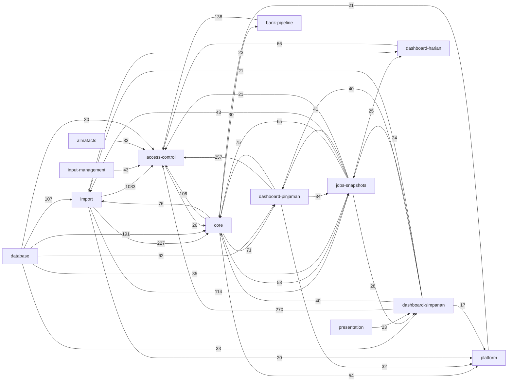

# Architecture Map

This is a compact cross-domain view. Edge labels are static relation counts, not runtime traffic.

```mermaid
flowchart LR
    d_d942f64886["import"] -->|1083| d_c393a69167["access-control"]
    d_90026ec21f["dashboard-simpanan"] -->|270| d_c393a69167["access-control"]
    d_c1933689a3["dashboard-pinjaman"] -->|257| d_c393a69167["access-control"]
    d_d942f64886["import"] -->|227| d_0d45f5fd46["core"]
    d_3549b0028b["database"] -->|191| d_0d45f5fd46["core"]
    d_39bcb775e4["bank-pipeline"] -->|136| d_c393a69167["access-control"]
    d_d942f64886["import"] -->|114| d_7c16aa6a77["jobs-snapshots"]
    d_3549b0028b["database"] -->|107| d_d942f64886["import"]
    d_0d45f5fd46["core"] -->|106| d_c393a69167["access-control"]
    d_0d45f5fd46["core"] -->|76| d_d942f64886["import"]
    d_c1933689a3["dashboard-pinjaman"] -->|75| d_0d45f5fd46["core"]
    d_0d45f5fd46["core"] -->|71| d_c1933689a3["dashboard-pinjaman"]
    d_a0a49fdd98["dashboard-harian"] -->|66| d_c393a69167["access-control"]
    d_7c16aa6a77["jobs-snapshots"] -->|65| d_0d45f5fd46["core"]
    d_3549b0028b["database"] -->|62| d_c1933689a3["dashboard-pinjaman"]
    d_0d45f5fd46["core"] -->|58| d_7c16aa6a77["jobs-snapshots"]
    d_0d45f5fd46["core"] -->|54| d_d294fcce0c["platform"]
    d_7c16aa6a77["jobs-snapshots"] -->|43| d_d942f64886["import"]
    d_b70a9d941d["input-management"] -->|43| d_c393a69167["access-control"]
    d_7c16aa6a77["jobs-snapshots"] -->|41| d_c1933689a3["dashboard-pinjaman"]
    d_90026ec21f["dashboard-simpanan"] -->|40| d_0d45f5fd46["core"]
    d_90026ec21f["dashboard-simpanan"] -->|40| d_c1933689a3["dashboard-pinjaman"]
    d_3549b0028b["database"] -->|35| d_7c16aa6a77["jobs-snapshots"]
    d_c1933689a3["dashboard-pinjaman"] -->|34| d_7c16aa6a77["jobs-snapshots"]
    d_3549b0028b["database"] -->|33| d_90026ec21f["dashboard-simpanan"]
    d_b89824cc5a["almafacts"] -->|33| d_c393a69167["access-control"]
    d_c1933689a3["dashboard-pinjaman"] -->|32| d_d294fcce0c["platform"]
    d_3549b0028b["database"] -->|30| d_c393a69167["access-control"]
    d_0d45f5fd46["core"] -->|30| d_39bcb775e4["bank-pipeline"]
    d_7c16aa6a77["jobs-snapshots"] -->|28| d_90026ec21f["dashboard-simpanan"]
    d_c393a69167["access-control"] -->|26| d_0d45f5fd46["core"]
    d_7c16aa6a77["jobs-snapshots"] -->|25| d_a0a49fdd98["dashboard-harian"]
    d_90026ec21f["dashboard-simpanan"] -->|24| d_7c16aa6a77["jobs-snapshots"]
    d_d942f64886["import"] -->|23| d_a0a49fdd98["dashboard-harian"]
    d_bfac314fef["presentation"] -->|23| d_90026ec21f["dashboard-simpanan"]
    d_d294fcce0c["platform"] -->|21| d_0d45f5fd46["core"]
    d_90026ec21f["dashboard-simpanan"] -->|21| d_d942f64886["import"]
    d_7c16aa6a77["jobs-snapshots"] -->|21| d_c393a69167["access-control"]
    d_d942f64886["import"] -->|20| d_d294fcce0c["platform"]
    d_90026ec21f["dashboard-simpanan"] -->|17| d_d294fcce0c["platform"]
```

## Domain Index

| Domain | Nodes | Detail |
| --- | ---: | --- |
| import | 2832 | [open](domains/import.md) |
| core | 1718 | [open](domains/core.md) |
| dashboard-pinjaman | 1095 | [open](domains/dashboard-pinjaman.md) |
| database | 819 | [open](domains/database.md) |
| jobs-snapshots | 722 | [open](domains/jobs-snapshots.md) |
| dashboard-simpanan | 645 | [open](domains/dashboard-simpanan.md) |
| dashboard-harian | 369 | [open](domains/dashboard-harian.md) |
| bank-pipeline | 363 | [open](domains/bank-pipeline.md) |
| presentation | 291 | [open](domains/presentation.md) |
| access-control | 201 | [open](domains/access-control.md) |
| prognosa | 154 | [open](domains/prognosa.md) |
| almafacts | 109 | [open](domains/almafacts.md) |
| platform | 106 | [open](domains/platform.md) |
| marketshare | 106 | [open](domains/marketshare.md) |
| knowledge-graph | 106 | [open](domains/knowledge-graph.md) |
| input-management | 51 | [open](domains/input-management.md) |
| kpi | 46 | [open](domains/kpi.md) |
| routing | 2 | [open](domains/routing.md) |
